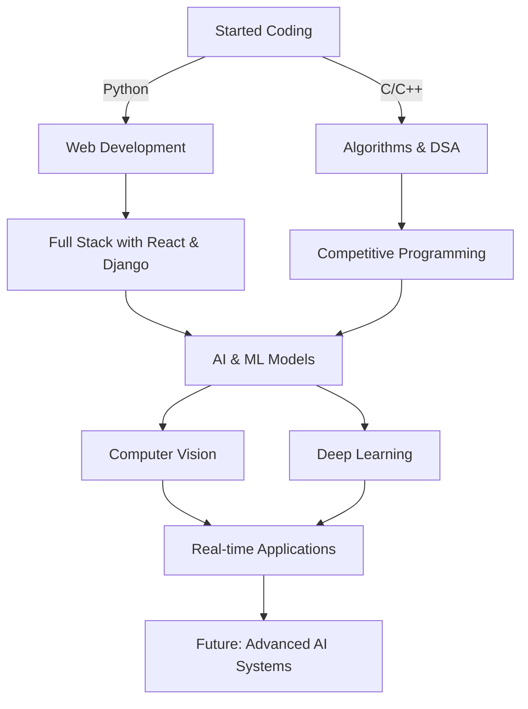

  

  <!-- Sleek wavy divider -->
  

<h1 align="center">
  
  Welcome to my digital playground
</h1>

  

<!-- Modern coding animation -->

## 💫 About Me

- 🎓 AI/ML undergrad at Dronacharya College of Engineering, Gurugram
- 🔭 I'm currently working on **advanced computer vision systems**
- 🌱 I'm currently mastering **TensorFlow and cloud deployment**
- 👯 I'm looking to collaborate on **AI/ML projects with social impact**
- 💬 Ask me about **Python, Computer Vision, Deep Learning**
- ⚡ Fun fact: **I planted 1000+ trees as an NSS volunteer**
- 🥇 Finalist at IIT Indore National Analytics Competition
- 🧠 Passionate about **solving real-world problems with AI**

## 🚀 Tech Arsenal

  
  
  
  
  
  
  
  
  
  
  
  
  
  
  
  
  
  
  
  
  

## 🏆 Projects That Define Me

<table>
  <tr>
    <td width="50%">
      <h3 align="center">ALERTIC - Drowsiness Detection</h3>
      

        
        

          Real-time facial analysis system that detects drowsiness with 90%+ accuracy, integrating live stream monitoring with alert generation.
        

      

    </td>
    <td width="50%">
      <h3 align="center">Stock Price Prediction</h3>
      

        
        

          LSTM model with ~80% accuracy on historical stock data with Flask web app for real-time predictions and visualization.
        

      

    </td>
  </tr>
  <tr>
    <td width="50%">
      <h3 align="center">Fake/Real Audio Classifier</h3>
      

        
        

          CNN model to classify deepfake vs. real audio with 87% accuracy using Librosa for Mel spectrogram extraction.
        

      

    </td>
    <td width="50%">
      <h3 align="center">Portfolio Website</h3>
      

        
        

          Personal portfolio with HTML, CSS, JavaScript, Anime.js featuring smooth animations and responsive layout.
        

      

    </td>
  </tr>
</table>

## 🌟 Professional Experience

  <table>
    <tr>
      <td>
        
      </td>
      <td>
        <h3>Software Development Intern</h3>
        
<strong>Agratas Infotech Pvt Ltd – Noida</strong> (Aug 2024 – Oct 2024)

        <ul>
          <li>Developed ERP modules using Django, improving internal data flow by 30%</li>
          <li>Integrated REST APIs, wrote documentation to improve onboarding</li>
          <li>Collaborated with cross-functional teams to deliver features on schedule</li>
        </ul>
      </td>
    </tr>
    <tr>
      <td>
        <h3>Deep Learning Intern</h3>
        
<strong>IGDTUW Center of Excellence AI – New Delhi</strong> (Jun 2024 – Jul 2024)

        <ul>
          <li>Built CNNs for object detection with 90%+ accuracy</li>
          <li>Reduced inference time by 20% in real-time vision pipeline</li>
          <li>Participated in research projects with industry applications</li>
        </ul>
      </td>
      <td>
        
      </td>
    </tr>
  </table>

## 📈 GitHub Analytics

  
  

  

  

## 🎯 My AI/ML Journey

## 🧠 AI Research Interests

  <table>
    <tr>
      <td align="center" width="50%">
        
      </td>
      <td width="50%">
        <ul>
          <li>🔍 <b>Computer Vision</b>: Object detection, image segmentation, and gesture recognition</li>
          <li>🤖 <b>Natural Language Processing</b>: Semantic analysis and transformer architectures</li>
          <li>🧪 <b>Reinforcement Learning</b>: Multi-agent systems and game theory applications</li>
          <li>📊 <b>Data Visualization</b>: Making complex data understandable through visual storytelling</li>
          <li>🔮 <b>Future Interest</b>: Neuro-symbolic AI combining neural networks with symbolic reasoning</li>
        </ul>
      </td>
    </tr>
  </table>

## 🏆 Achievements & Certifications

  <table>
    <tr>
      <td align="center">
        
      </td>
      <td align="center">
        
      </td>
    </tr>
    <tr>
      <td align="center">
        
      </td>
      <td align="center">
        
      </td>
    </tr>
    <tr>
      <td align="center">
        
      </td>
      <td align="center">
        
      </td>
    </tr>
  </table>

## 📚 Learning Resources I Recommend

  <table>
    <tr>
      <td align="center">
        
        
The best resource for practical ML implementation

      </td>
      <td align="center">
        
        
Harvard's comprehensive AI foundation

      </td>
    </tr>
    <tr>
      <td align="center">
        
        
Excellent Python & ML tutorials

      </td>
      <td align="center">
        
        
Where I sharpen my data science skills

      </td>
    </tr>
  </table>

## 🌍 Community Involvement

  <table>
    <tr>
      <td>
        
      </td>
      <td>
        <h3>NSS Volunteer</h3>
        <ul>
          <li>Led initiatives for clothes redistribution in underserved communities</li>
          <li>Planted 1,000+ trees through environmental awareness campaigns</li>
          <li>Conducted local health surveys to improve community wellness</li>
        </ul>
      </td>
    </tr>
  </table>

## 🎮 When I'm Not Coding

  
  
  
  

## 💭 Daily Tech Quote

  <table>
    <tr>
      <td>
        
      </td>
      <td>
        <blockquote>
          "The best way to predict the future is to invent it." — Alan Kay
        </blockquote>
        
<i>Refresh daily for new inspiration</i>

      </td>
      <td>
        
      </td>
    </tr>
  </table>

## 🎵 Current Coding Playlist

  
  <table>
    <tr>
      <th>Track Name</th>
      <th>Artist</th>
      <th>Mood</th>
    </tr>
    <tr>
      <td>Midnight City</td>
      <td>M83</td>
      <td>Focus</td>
    </tr>
    <tr>
      <td>Strobe</td>
      <td>deadmau5</td>
      <td>Deep Work</td>
    </tr>
    <tr>
      <td>Starlight</td>
      <td>Muse</td>
      <td>Debugging</td>
    </tr>
    <tr>
      <td>The Less I Know The Better</td>
      <td>Tame Impala</td>
      <td>Creative Coding</td>
    </tr>
  </table>

## 🧩 Fun AI Challenges I'm Tackling

  <table>
    <tr>
      <td align="center">
        
        <h4>Building AI for gesture-based PPT presentation system</h4>
      </td>
      <td align="center">
        
        <h4>Building a chess bot that plays like me</h4>
      </td>
    </tr>
    <tr>
      <td align="center">
        
        <h4>Generating music based on my mood</h4>
      </td>
      <td align="center">
        
        <h4>AI that writes in my personal style</h4>
      </td>
    </tr>
  </table>

## 🔮 Where I See Myself in 5 Years

  
  
Leading an AI research team focused on developing ethical, accessible AI solutions that address critical global challenges in healthcare, education, and sustainability.

## 🤝 Connect With Me

  
  
  
  
  

## ⚡ Random Dev Quote

  

  

  
  <h3>Thanks for stopping by!</h3>

<!-- Sleek wavy divider -->

